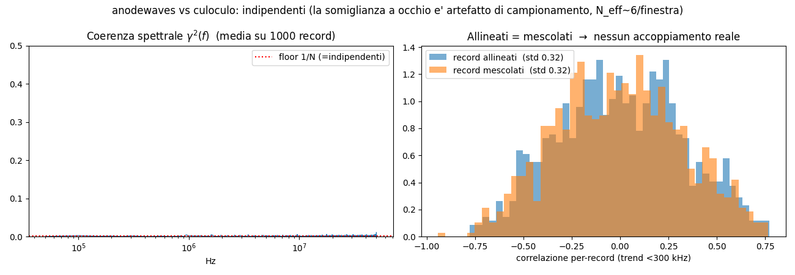
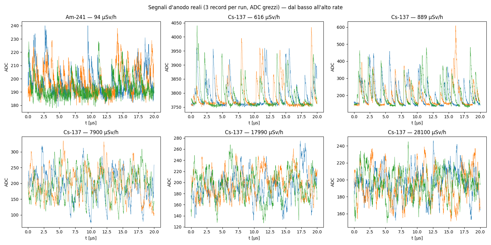
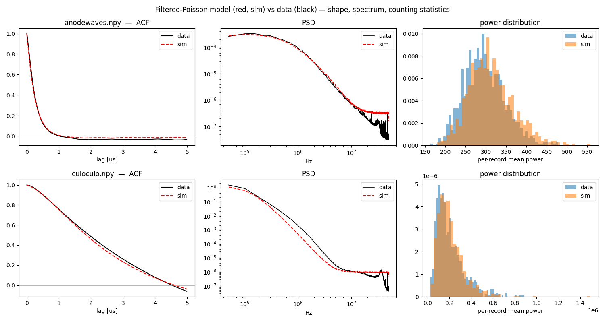
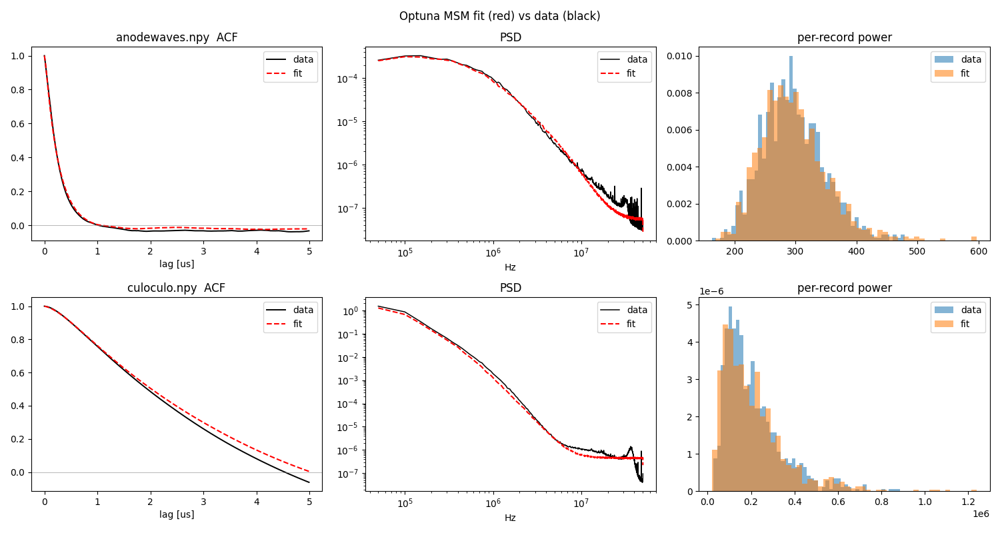
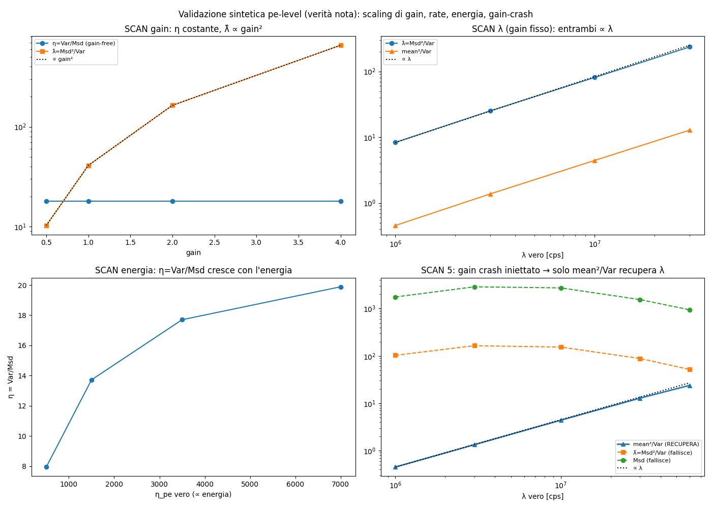
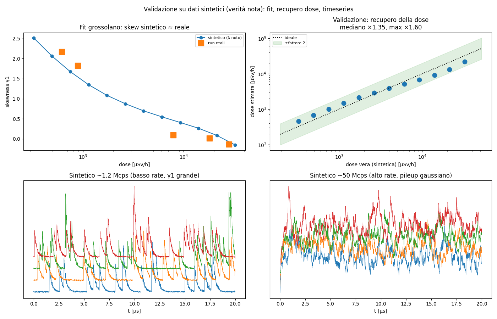

# High Rate PMT dose estimation
---

## Indice del ragionamento

- [High Rate PMT dose estimation](#high-rate-pmt-dose-estimation)
  - [Indice del ragionamento](#indice-del-ragionamento)
  - [1. Il problema](#1-il-problema)
  - [2. Il rivelatore e i dati](#2-il-rivelatore-e-i-dati)
  - [3. Il modello: rumore shot (Poisson filtrato)](#3-il-modello-rumore-shot-poisson-filtrato)
  - [4. I cumulanti e il teorema di Campbell](#4-i-cumulanti-e-il-teorema-di-campbell)
    - [Cosa sono i cumulanti](#cosa-sono-i-cumulanti)
    - [Il teorema di Campbell](#il-teorema-di-campbell)
  - [5. I protagonisti: λ, energia, il gain g](#5-i-protagonisti-λ-energia-il-gain-g)
  - [6. Il regime di pile-up: l'occupancy λτ](#6-il-regime-di-pile-up-loccupancy-λτ)
  - [7. L'idea chiave: statistiche *gain-free*](#7-lidea-chiave-statistiche-gain-free)
  - [8. Chi è η, chi è λ: le stime, una per una](#8-chi-è-η-chi-è-λ-le-stime-una-per-una)
    - [λ — il rate. Due strade.](#λ--il-rate-due-strade)
    - [η — l'energia media (gain-free).](#η--lenergia-media-gain-free)
  - [9. Il metodo Target e perché va corretto](#9-il-metodo-target-e-perché-va-corretto)
  - [10. La pipeline di dose (il risultato principale)](#10-la-pipeline-di-dose-il-risultato-principale)
  - [11. Come abbiamo verificato di non star sognando: simulazione e fit](#11-come-abbiamo-verificato-di-non-star-sognando-simulazione-e-fit)
  - [12. Cosa NON si può misurare (limiti onesti)](#12-cosa-non-si-può-misurare-limiti-onesti)
  - [13. Spin-off: il modello *ladder* della perdita di gain](#13-spin-off-il-modello-ladder-della-perdita-di-gain)
    - [Il meccanismo, a parole](#il-meccanismo-a-parole)
    - [Il modello minimale (per capire il ginocchio)](#il-modello-minimale-per-capire-il-ginocchio)
    - [Il modello ladder completo (niente approssimazioni)](#il-modello-ladder-completo-niente-approssimazioni)
    - [Il ladder riproduce i dati reali](#il-ladder-riproduce-i-dati-reali)
  - [14. Cosa manca per chiudere davvero il conto](#14-cosa-manca-per-chiudere-davvero-il-conto)
  - [15. File e bibliografia](#15-file-e-bibliografia)
    - [In una riga](#in-una-riga)

---

## 1. Il problema

Abbiamo un **fotomoltiplicatore (PMT)** accoppiato a uno scintillatore, che
guarda una sorgente radioattiva. Vogliamo misurare la **dose**. Il problema è che la sorgente è così intensa che il PMT
lavora a **rate altissimo**: gli impulsi prodotti dai singoli eventi
**si sovrappongono continuamente** (pile-up).
Il modo classico di fare dosimetria — *"riconosci ogni impulso, misurane
l'altezza, mettili in un istogramma"* (Pulse Height Analysis) — qui **non
funziona**: gli impulsi non sono più separabili. Il segnale digitizzato
assomiglia a un rumore continuo, non a una sequenza di picchi.

La proposta è ribaltare il punto di vista:

> Invece di combattere il pile-up cercando di separare gli impulsi, lo
> **modelliamo**. Trattiamo il segnale come un **processo stocastico continuo**
> e stimiamo la dose dalle sue **proprietà statistiche** (media, varianza,
> asimmetria, autocorrelazione…), senza mai cercare i singoli impulsi.

Questo approccio è standard in telecomunicazioni, fotonica, radar — ma poco
usato in elettronica nucleare, che resta ancorata al pulse-finding. È lì che
sta lo spazio per fare qualcosa di nuovo.

---

## 2. Il rivelatore e i dati

Un **PMT** funziona così: un fotone di scintillazione strappa un elettrone dal
**fotocatodo** (il "fotoelettrone"); questo viene accelerato verso una serie di
elettrodi, i **dinodi**, ognuno dei quali moltiplica il numero di elettroni di
un fattore δ ≈ 3–5. Con ~10 dinodi in cascata si arriva a un **gain**
complessivo $G = \prod_i \delta_i \sim 10^6$: un singolo fotoelettrone diventa
un milione di elettroni, cioè un impulso di corrente misurabile all'**anodo**.
Su questo torneremo nel §13, perché il gain è il vero antagonista di questa
storia.

Abbiamo due tipi di dato.

**(a) Due file di caratterizzazione** — `anodewaves.npy` e `culoculo.npy`
(nomi di lavoro), ciascuno **1000 record × 2000 campioni**, a $f_s = 100$ MS/s
(cioè $\Delta t = 10$ ns, finestra di **20 µs** per record). Servono a capire
*che tipo di segnale* stiamo guardando. Sono due canali diversi:

- **`anodewaves`** — segnale d'anodo "veloce": fuzz rapido, tempo di
  correlazione τ ≈ 250 ns;
- **`culoculo`** — uscita di un **preamplificatore di carica**: integra la
  corrente, quindi vaga lentamente, τ ≈ µs.


Un primo dubbio ragionevole: sovrapponendo pochi record *sembra* che i due file
seguano gli stessi trend lenti — sono forse lo stesso segnale, uno filtrato
dall'altro? **No.** Lo abbiamo verificato in modo rigoroso (coerenza spettrale
mediata su 1000 record, piatta al floor $1/N$; test allineati-vs-mescolati:
distribuzioni identiche). La somiglianza è un **artefatto**: `culoculo` ha solo
~6–7 oscillazioni lente *indipendenti* per finestra, e due tracce con così pochi
gradi di libertà "sembrano" correlate per puro caso (~14% dei record ha
$|r|>0.5$ anche mescolando gli indici a caso).



**(b) Sei run reali a dose nota** (`jeanluke/anode_waveforms/*.h5`) — è il
dataset che ci permette di *verificare* tutto, perché conosciamo la risposta.
Ogni run è $10^4 \times 2000$ campioni, **DC-coupled** (importante: vediamo il
livello continuo, non solo le fluttuazioni). Sorgenti Am-241 e Cs-137 a distanze
diverse, cioè a **dose nota** che spazia su ~2.5 decadi:

| nuclide | dose [µSv/h] | rate atteso λ [Mcps] | occupancy λτ | regime |
|---|---|---|---|---|
| Am-241 | 94 | 0.17 | 0.04 | impulsi **risolti** |
| Cs-137 | 616 | 1.14 | 0.26 | pile-up leggero |
| Cs-137 | 889 | 1.65 | 0.38 | pile-up leggero |
| Cs-137 | 7900 | 14.6 | 3.4 | pile-up medio |
| Cs-137 | 17990 | 33.3 | 7.7 | pile-up forte |
| Cs-137 | 28100 | 52 | 12 | pile-up **profondo** |



La dose qui è un **input noto** (dai metadati; verificata con la legge
dell'inverso del quadrato $\text{dose}\approx k\cdot\text{attività}/d^2$, torna a
±6%). L'obiettivo è **ricostruirla dal segnale** e vedere quanto ci
avviciniamo.

---

## 3. Il modello: rumore shot (Poisson filtrato)

Il modello di tutto il lavoro è uno solo, e va imparato bene perché è il
pavimento su cui poggia il resto. Il segnale è una **sovrapposizione di impulsi
identici, che arrivano a tempi casuali**:

$$ y(t) = \sum_k A_k\, h(t - t_k) + n(t) $$

I quattro pezzi:

- **$t_k$** — i tempi d'arrivo degli eventi. Sono un **processo di Poisson** di
  rate **λ**: in media λ eventi al secondo, ma con i tempi tra un evento e il
  successivo casuali (esponenziali). È l'ipotesi naturale per decadimenti
  radioattivi indipendenti.
- **$A_k$** — la "carica" del k-esimo evento (∝ all'energia depositata). È
  casuale: eventi diversi depositano energie diverse, e il PMT stesso ha una
  fluttuazione di gain. La sua distribuzione si chiama **SER** (*single-electron
  response*) o spettro di ampiezza.
- **$h(t)$** — la **forma del singolo impulso** (risposta del rivelatore +
  elettronica). Per l'anodo è ~esponenziale a un polo; per il preamp di carica è
  un bi-esponenziale (rise + fall).
- **$n(t)$** — il rumore elettronico additivo (piccolo, sottodominante).

Questo oggetto ha un nome in letteratura: **shot noise**, o **processo di
Poisson filtrato**, o **compound Poisson**. La parola "compound" ("composto")
indica proprio che a ogni arrivo di Poisson è associata una marca casuale $A_k$.

**Un punto che confonde spesso.** Il segnale sembra "rumore colorato /
autocorrelato". Verrebbe da pensare a un rumore additivo con struttura. **Non è
così**: la struttura temporale (l'autocorrelazione) nasce dal **filtro $h$**, non
da $n(t)$. Ogni impulso dura ~τ, quindi due campioni distanti meno di τ sono
correlati semplicemente perché appartengono spesso allo stesso impulso. La PSD
che si osserva (Lorentziana per l'anodo, più ripida per il preamp) è esattamente
$|H(f)|^2$ = il modulo quadro della trasformata di $h$. Il "rumore" *è il
processo stesso*.

---

## 4. I cumulanti e il teorema di Campbell

Qui introduciamo lo strumento matematico che fa girare tutto. Serve un minuto
di pazienza, poi diventa un martello universale.

### Cosa sono i cumulanti

Data una variabile casuale, i **cumulanti** $\kappa_n$ sono un modo alternativo
(ai momenti) di descriverne la distribuzione. I primi quattro sono facce note:

| cumulante | è | forma normalizzata |
|---|---|---|
| $\kappa_1$ | la **media** | — |
| $\kappa_2$ | la **varianza** | — |
| $\kappa_3$ | lega all'**asimmetria** (skewness) | $\gamma_1 = \kappa_3/\kappa_2^{3/2}$ |
| $\kappa_4$ | lega alla **"codosità"** (excess kurtosis) | $\gamma_2 = \kappa_4/\kappa_2^{2}$ |

Due proprietà rendono i cumulanti speciali, e sono le uniche due che useremo:

1. **Additività su somme indipendenti.** Il cumulante della somma di variabili
   indipendenti è la somma dei cumulanti. (I momenti no: la varianza sì, ma i
   momenti terzi/quarti si mescolano.)
2. **Una gaussiana ha $\kappa_n = 0$ per ogni $n \ge 3$.** Questo è cruciale:
   $\kappa_3, \kappa_4$ **misurano quanto una distribuzione è lontana dall'essere
   gaussiana**. Teniamolo a mente per il §6.

### Il teorema di Campbell

Applicando l'additività al nostro shot noise (una somma di tantissimi impulsi
indipendenti), si ottiene un risultato pulitissimo — il **teorema di Campbell**:

$$ \boxed{\;\kappa_n[y] = \lambda\,\langle A^n\rangle\, I_n\,,\qquad I_n = \int h(t)^n\,dt\;} $$

Ogni cumulante del segnale è il prodotto di tre fattori: il **rate λ**, il
**momento n-esimo dell'ampiezza** $\langle A^n\rangle$, e un **integrale di forma**
$I_n$ (una costante che dipende solo da $h$). Esplicitamente:

- $\kappa_1 = \lambda\langle A\rangle I_1$ → la **media** = corrente DC;
- $\kappa_2 = \lambda\langle A^2\rangle I_2$ → la **varianza** = potenza di fluttuazione;
- $\kappa_3 = \lambda\langle A^3\rangle I_3$, $\kappa_4 = \lambda\langle A^4\rangle I_4$, …

Un corollario che useremo: per $h$ esponenziale a un polo,
$h(t)=e^{-t/\tau}$, l'**autocovarianza** del processo è
$C(\Delta) = \lambda\langle A^2\rangle\frac{\tau}{2}e^{-|\Delta|/\tau}$ — cioè un
processo con ACF esponenziale, un **Ornstein–Uhlenbeck** guidato da Poisson. È
proprio ciò che si vede nell'anodo (τ ≈ 250 ns).

**Perché tutto questo è potente:** ogni statistica che sappiamo misurare (media,
varianza, skewness…) diventa una **equazione** in tre incognite fisiche (λ,
l'energia via $\langle A^n\rangle$, la forma via $I_n$). Misurando più
statistiche, mettiamo insieme un sistema e proviamo a invertirlo. Tutto il lavoro
è, in fondo, questo gioco di inversione — con l'accortezza di scegliere le
combinazioni giuste (§7).

---

## 5. I protagonisti: λ, energia, il gain g

Fermiamoci a presentare i personaggi, perché li confonderemo di continuo se non
li fissiamo ora.

- **λ (lambda) — il rate.** Numero di eventi al secondo che arrivano al
  rivelatore. "Evento" = un decadimento della sorgente che deposita energia →
  scintillazione → fotoelettroni. È la grandezza che vogliamo perché, a energia
  fissa, **la dose è proporzionale a λ** (più eventi al secondo = più radiazione).
  Ordine di grandezza qui: da ~0.2 a ~50 milioni di conteggi al secondo (Mcps).

- **$A_k$ e l'energia.** L'ampiezza del singolo evento, proporzionale
  all'energia depositata. La distribuzione delle $A_k$ (la SER / spettro di
  energia) entra solo attraverso i suoi momenti $\langle A^n\rangle$.
  L'**energia media per evento** è ciò che, moltiplicato per λ, dà la dose.

- **g — il gain del PMT.** Il fattore di moltiplicazione dei dinodi. **È il
  guaio.** Il gain **scala tutte le ampiezze**: se $g$ raddoppia, ogni impulso
  raddoppia, $A_k \to g\,A_k$. E in questo rivelatore $g$ **non è costante**:
  con un partitore resistivo passivo, ad alto rate il gain **deriva e poi
  collassa** (§13). Quindi qualunque statistica che dipenda da $g$ è
  inaffidabile: non sappiamo separare "più eventi" da "gain più basso". Questo
  è il muro contro cui sbatte l'approccio ingenuo.

- **dose** $\dot H = k\,\lambda\,\langle E\rangle$ — rate × energia media ×
  fattore di conversione. Il nostro obiettivo finale.

Vediamo subito come il gain entra nei cumulanti. Sotto lo scaling $A \to gA$, per
Campbell $\kappa_n = \lambda\langle A^n\rangle I_n \to g^n\,\kappa_n$. Cioè:

$$ \text{media} \propto g,\quad \text{Var} \propto g^2,\quad \kappa_3 \propto g^3,\quad \kappa_4 \propto g^4 $$

Ogni cumulante porta una potenza diversa di $g$. Questo, lungi dall'essere un
problema, è la **chiave della soluzione** — §7.

---

## 6. Il regime di pile-up: l'occupancy λτ

Quanto è "affollato" il segnale? Il numero adimensionale che conta è
l'**occupancy**:

$$ \text{occupancy} = \lambda\,\tau = \text{numero medio di impulsi che si sovrappongono in un tempo } \tau $$

dove τ è la durata di un impulso. Tre regimi, e tre comportamenti diversi:

1. **λτ ≪ 1 — impulsi risolti.** Gli impulsi sono isolati, ben separati. Il
   segnale è "spiky": tante zone di baseline e picchi occasionali → distribuzione
   fortemente **asimmetrica e a coda lunga** → $\kappa_3, \kappa_4$ **grandi**.
   (Caso Am-241, λτ = 0.04.)

2. **λτ ~ 1 — pile-up moderato.** Gli impulsi cominciano a sovrapporsi ma la
   granularità si intravede ancora.

3. **λτ ≫ 1 — pile-up profondo.** Migliaia di impulsi si sommano ad ogni istante.
   Qui entra in gioco il **teorema del limite centrale**: la somma di tantissimi
   contributi indipendenti tende a una **gaussiana**. E per una gaussiana (§4)
   **$\kappa_3, \kappa_4 \to 0$**. Il segnale diventa un fuzz gaussiano liscio,
   che ha perso ogni memoria del "quanti erano" e "quanto grandi". (Caso Cs-137
   28100, λτ = 12.)

Questa è la tensione centrale di tutto il progetto:

> Più il rate è alto (regime che ci interessa!), più il segnale
> **gaussianizza**, più le informazioni di conteggio e di energia
> **evaporano** dai cumulanti alti. È un muro fisico, non un difetto di metodo.

Lo vediamo direttamente nei dati: l'excess kurtosis passa da **+6.9** (Am-241,
risolto) a **−0.08** (Cs 28100, gaussiano) monotonamente con l'occupancy prevista.
Il regime di pile-up predetto dalla dose è quindi **confermato dal segnale**, e
in modo *gain-free* (kurtosi e skewness non dipendono da $g$, §7) — un
cross-check pulito.

---

## 7. L'idea chiave: statistiche *gain-free*

Ricordiamo il problema (§5): il gain $g$ deriva e collassa, e **inquina** ogni
statistica che dipende da lui. La soluzione non è *correggere* il gain (non lo
conosciamo), ma **scegliere combinazioni di statistiche in cui $g$ si cancella
da solo**.

Il trucco è banale una volta visto. Sappiamo che $\kappa_n \propto g^n$. Allora
costruiamo **rapporti in cui le potenze di $g$ si elidono**:

$$ \gamma_1 = \frac{\kappa_3}{\kappa_2^{3/2}} \propto \frac{g^3}{(g^2)^{3/2}} = \frac{g^3}{g^3} = 1 \quad(\text{gain-free!}) $$

$$ \gamma_2 = \frac{\kappa_4}{\kappa_2^{2}} \propto \frac{g^4}{g^4} = 1 \quad(\text{gain-free!}) $$

$$ \frac{\text{media}^2}{\text{Var}} \propto \frac{g^2}{g^2} = 1 \quad(\text{gain-free!}) $$

Ecco la tabella completa dei nostri strumenti, con cosa misura ciascuno e come
scala col gain. **Questa tabella è il cuore operativo della relazione.**

> Prima di leggerla, due sigle che compaiono qui e le incontreremo spesso:
> **Msd** = *mean square successive difference*, una misura di potenza robusta
> alle derive lente (definita per bene in [§8](#8-chi-è-η-chi-è-λ-le-stime-una-per-una)); per ora basta sapere che
> scala come la varianza, $\propto g^2$. **CV** = *coefficient of variation* =
> deviazione standard / media (una dispersione relativa, adimensionale).
> $\tau_\text{eff}$ è la durata efficace dell'impulso, $\approx \tau$.

| statistica | teoria (Campbell) | scala col gain | misura fisicamente | gain-free? |
|---|---|---|---|---|
| media $m=\kappa_1$ | $\lambda\langle A\rangle I_1$ | $\propto g$ | corrente DC ≈ dose non-compensata | ❌ |
| Var $=\kappa_2$ | $\lambda\langle A^2\rangle I_2$ | $\propto g^2$ | potenza di fluttuazione | ❌ |
| Msd $=C(0)-C(\delta)$ | $\propto \lambda\langle A^2\rangle$ (come Var, ad alta-f) | $\propto g^2$ | potenza shot ad alta-f | ❌ |
| skewness $\gamma_1$ | $\propto \lambda^{-1/2}$ | invariante | $1/\sqrt{\text{occupancy}}$; segno = polarità | ✅ |
| excess kurtosis $\gamma_2$ | $\propto \lambda^{-1}$ | invariante | $1/\text{occupancy} \approx 1/(\lambda\tau_\text{eff})$ | ✅ |
| von Neumann $\text{Msd}/\text{Var}$ | (forma) | invariante | rise/roughness vs $\tau_\text{corr}$ | ✅ |
| CV potenza per-record | $\propto 1/\sqrt{\text{occupancy}}$ | invariante | # eventi per finestra | ✅ |
| **mean²/Var** | $\lambda\langle A\rangle^2/\langle A^2\rangle$ | invariante | **rate λ** | ✅ |
| **η = Var/Msd** | $\langle A^2\rangle/\langle A\rangle$ | invariante | **energia media** | ✅ |

Due cose da notare:

- Le statistiche **gain-dipendenti** (media, Var, Msd) sono quelle che
  istintivamente useresti per misurare "quanto segnale c'è" — e sono proprio
  quelle rovinate dal crollo del gain. Nei dati reali infatti la varianza e la
  Msd **anti-correlano con la dose** (crescono e poi *scendono*!), perché il gain
  cala più in fretta di quanto il rate salga. Ingannevoli.
- Le statistiche **gain-free** (skewness, kurtosi, mean²/Var, η) sono la nostra
  cassetta degli attrezzi buona.

Nel dettaglio, l'**excess kurtosis** merita una riga:
$$ \gamma_2 = \frac{\kappa_4}{\kappa_2^2} = \frac{1}{\lambda}\,\frac{\langle A^4\rangle}{\langle A^2\rangle^2}\,\frac{I_4}{I_2^2} \;\propto\; \frac{1}{\lambda\tau_\text{eff}} $$
cioè è **l'inverso dell'occupancy**: grande a basso rate (spiky), → 0 in pile-up
profondo (gaussiano). Non misura l'energia: misura **quanto è affollato** il
segnale. La skewness porta la stessa informazione ($\propto 1/\sqrt{\lambda\tau}$)
più il **segno** (la polarità dell'impulso). Sono i nostri "termometri" del
regime.

---

## 8. Chi è η, chi è λ: le stime, una per una

Adesso possiamo presentare per bene i due protagonisti che il committente voleva
chiari: **λ e η**. Sono le due grandezze fisiche che estraiamo, ciascuna con la
sua ricetta gain-free.

### λ — il rate. Due strade.

**Strada A — `mean²/Var` (in continua, DC).** È la stima più bella perché il gain
si cancella *esattamente*, per *qualunque* legge $g(\lambda)$:
$$ \frac{\text{media}^2}{\text{Var}} = \frac{(g\lambda\langle A\rangle I_1)^2}{g^2\lambda\langle A^2\rangle I_2} \;\propto\; \lambda\,\frac{\langle A\rangle^2}{\langle A^2\rangle} $$
Il gain sparisce anche *dentro il collasso*. Costo: serve la **media assoluta** del
segnale, cioè lo **zero vero** (il *pedestal*). Con dati a baseline sottratta non
ce l'abbiamo → serve un **dark run** (§14). È il pezzo mancante più prezioso.

**Strada B — cumulanti pari $\kappa_2^2/\kappa_4$ (in alternata, AC).** Non serve
la media:
$$ \lambda \;\propto\; \frac{\kappa_2^2}{\kappa_4}\cdot(\text{fattore di forma/SER}) $$
Funziona a pile-up **moderato**, ma **muore in pile-up profondo** (là
$\kappa_4 \to 0$ e il rapporto esplode). Sui nostri dati funziona per l'anodo
veloce, fallisce per il preamp lento (troppo pochi tempi di correlazione per
finestra, $\kappa_4$ distorto).

**Strada C — via la skewness (occupancy).** Poiché $\gamma_1 \propto
1/\sqrt{\lambda\tau}$, una **calibrazione** monotòna lega la skewness al rate.
È la strada che regge su tutto il range utile e che useremo nella pipeline (§10).

### η — l'energia media (gain-free).

$$ \boxed{\;\eta \;\equiv\; \frac{\text{Var}}{\text{Msd}} \;\propto\; \frac{\langle A^2\rangle}{\langle A\rangle}\;} $$

**Chi è η, a parole:** è un **proxy dell'energia media per evento**, costruito
come rapporto tra due potenze (la varianza totale e la potenza shot ad alta
frequenza). Entrambe scalano come $g^2$, quindi nel rapporto **il gain sparisce**.
Dimensionalmente è un'energia (× costanti), e nei dati Cs cresce/decresce coerente
con l'energia depositata. Il suo limite: vale solo **nel regime giusto** (pile-up
pieno con granularità pe risolta, basso rumore); fuori regime diventa rumoroso
(sui nostri dati spesso ne siamo ai margini, quindi η dà l'ordine di grandezza,
non la spettroscopia).

**Msd**, che compare al denominatore, va spiegato perché è un attore ricorrente:
è la **Mean Square of Successive Differences**,
$\text{Msd} = \frac12\langle (x_{i+1}-x_i)^2\rangle = C(0)-C(\delta)$, cioè la
varianza delle differenze tra campioni successivi. Il suo pregio (dovuto a **von
Neumann**) è che, usando solo *differenze*, **cancella le derive lente** (drift
termici, baseline wander, 1/f) che gonfierebbero la varianza semplice. È una
misura di potenza *robusta alle derive*.

---

## 9. Il metodo Target e perché va corretto

Esiste un metodo brevettato che fa esattamente dosimetria da PMT in pile-up: il
metodo **Target** (brevetto US2021/0055429 A1, Stein). Le sue equazioni operative:
$$ \text{Msd} = \lambda\,\eta \;(\text{Eq.2}),\qquad \eta = \frac{\text{Var}}{\text{Msd}}\;(\text{Eq.3}),\qquad \dot H = Z(\eta)\cdot\text{Msd}\;(\text{Eq.4}) $$
cioè: dalla Msd e dalla Var ricava un rate $\hat\lambda = \text{Msd}^2/\text{Var}$
e un'energia $\eta$, e compone la dose.

Lo abbiamo applicato ai 6 run reali e — punto delicato — **validato con un
simulatore a verità nota** (§11). La validazione ha rivelato un errore di segno
che val la pena raccontare, perché è istruttivo:


- **$\eta = \text{Var}/\text{Msd}$ è gain-free** (∝ energia). Verificato: in una
  scansione di gain ×0.5–4 a rate ed energia fissi, η resta **costante a 18.0**.
- **$\hat\lambda = \text{Msd}^2/\text{Var} \propto g^2$** — cioè **NON** è
  gain-free! Nella stessa scansione scala come $g^2$ (10→41→164→656). Quindi
  quando il gain collassa, $\hat\lambda$ collassa con lui e **anti-correla con la
  dose**. È esattamente ciò che si vede nei dati reali (Msd e λ̂ scendono mentre
  la dose sale).

La lezione: il rate **non** va preso da $\text{Msd}^2/\text{Var}$ (porta il
gain²), ma da **`mean²/Var`** (gain-free, §8) — che nella validazione
**sopravvive al crollo del gain**, o in alternativa dalla skewness. Target è
un ottimo punto di partenza, ma la sua stima di rate va sostituita con una
gain-free. È questa correzione che rende il metodo robusto al nostro hardware.

---

## 10. La pipeline di dose (il risultato principale)

Mettendo insieme i pezzi, ecco lo stimatore di dose finale — **deployabile**, che
usa **solo statistiche gain-free** e **nessun pedestal / dark run / correzione di
gain**.

**Idea:** $\dot H = k\,\lambda\,\langle E\rangle$. Il rate λ dalla **skewness**
$\gamma_1$ (proxy di occupancy, gain-free); l'energia $\langle E\rangle$ da **η**
(gain-free). Niente statistiche gain-dipendenti a runtime.

**Pipeline:**
1. Dal blocco di forme d'onda calcola le feature gain-free: $\gamma_1$ (skew),
   $\eta = \text{Var}/\text{Msd}$, $\gamma_2$ (kurt).
2. **Auto-diagnosi del regime** dalla kurtosi + stabilità di $\gamma_1$: se
   $\gamma_1$ è instabile / $\gamma_2 \gg 1$ → *bassissimo rate, impulsi risolti*
   → la pipeline dice "**conta gli impulsi**" (fuori dal metodo statistico; è il
   caso Am-241). Altrimenti procede.
3. **Rate** da $\gamma_1$ via calibrazione; **energia** da η; **dose** da
   $\ln\dot H = a + b\,\text{asinh}(\gamma_1)$.

Calibrazione su questi dati (Cs-137):
$$ \ln(\dot H\,[\mu\text{Sv/h}]) = 9.685 - 2.158\,\text{asinh}(\gamma_1) $$
(l'$\text{asinh}$ — seno iperbolico inverso — è usato al posto del logaritmo
perché è quasi lineare vicino a zero e logaritmico per $|\gamma_1|$ grande, e
soprattutto **accetta anche skewness negative**: nel pile-up profondo $\gamma_1$
può diventare leggermente $<0$, dove un $\ln$ esploderebbe.)

**Il risultato.** Dalla sola forma statistica del segnale si stima la dose entro
un **fattore ×1.24 mediano (×1.98 massimo) su 2.5 decadi**, in **leave-one-out**:


| dose vera [µSv/h] | dose stimata (LOO) | fattore d'errore |
|---|---|---|
| 616 | 602 | ×1.02 |
| 889 | 812 | ×1.09 |
| 7900 | 15680 | ×1.98 |
| 17990 | 14490 | ×1.24 |
| 28100 | 17650 | ×1.59 |

**Cos'è il "leave-one-out" (LOO), e perché il numero è onesto.** La calibrazione
ha 2 parametri ($a,b$) e i punti Cs sono solo 5. Se fittassi su tutti e 5 e
misurassi l'errore *sugli stessi 5*, starei barando: misurerei quanto bene una
retta ci passa in mezzo, non quanto predice una misura *nuova*. Il LOO evita
questo: per ogni run, **lo butto via**, ri-fitto sui 4 rimasti, e **predìco il
run escluso** con una calibrazione che non l'ha mai visto. Ripetuto 5 volte, dà
un errore **fuori-campione** — la stima onesta di quanto sbaglierei su una misura
mai usata per tarare.

**Perché è robusto/interessante:** gain-free *by design* (funziona anche sul run a
HV diversa); nessun dark run; auto-diagnosi del regime. **Limiti onesti:**
l'energia è rozza (~×1.5, buona per il fattore di conversione, non per
spettroscopia); ad alto rate $\gamma_1 \to 0$ (pile-up profondo) e la sensibilità
cala (il punto peggiore, 7900, è proprio alla transizione); la calibrazione
$a,b$ va ri-tarata per un altro tubo/HV, ma la *struttura* gain-free è
trasferibile.

---

## 11. Come abbiamo verificato di non star sognando: simulazione e fit

Ogni affermazione sopra è stata controllata contro **verità nota**, perché su
dati reali non conosciamo λ, energia e gain in modo indipendente. Tre livelli di
verifica.

**(a) Simulatore coerente del segnale (`simulate_pmt.py`).** Genera lo shot noise
in due modi equivalenti — somma esatta di impulsi, e integrazione della SDE a
salti $dY = -\frac{Y}{\tau}dt + dJ$ (la forma "equazione differenziale
stocastica" del processo). Confronto modello-vs-dati su autocorrelazione, PSD e
distribuzione di potenza per record:



**(b) Fit quantitativo dei parametri (`fit_simulator.py`).** Invece di tarare a
mano, i parametri (τ_rise, τ_fall, rate, larghezza SER, rumore) sono fittati ai
dati con *method of simulated moments* (ottimizzatore Optuna, 500 trial/file).
Il gain assoluto è degenere e esce dal conto (tutte le metriche sono scale-free —
di nuovo il tema gain-free). Una lezione tecnica utile: per far combaciare la
**forma d'onda** (non solo gli spettri integrati) è servita una metrica sensibile
alla **scala fine** (la frazione di potenza in banda media 0.3–8 MHz), altrimenti
il fit smussava troppo il rise-time.



*(La "distanza di Wasserstein" è una misura di quanto due distribuzioni
differiscono — intuitivamente, il "lavoro" per spostare una nell'altra; qui
confronta la PSD misurata con quella simulata.)*

**(c) Simulatore a livello di fotoelettrone (`pe_synth.py`).** Il più importante
per validare le *stime*: un processo di Cox/branching (Poisson di eventi → η
fotoelettroni ciascuno → decadimento di scintillazione → shot pe → gain +
rumore), con **λ, energia e gain imposti da noi**. Qui abbiamo smontato e
verificato ogni affermazione del §7–9:



- scansione di **gain** (λ, η fissi): **η costante**, $\hat\lambda \propto g^2$
  → conferma cosa è gain-free e cosa no;
- scansione di **λ** (gain fisso): mean, Var, Msd, λ̂ tutti ∝ λ → il metodo
  Target funziona *quando il gain è fisso*;
- **gain-crash iniettato** $g(\lambda) = g_0/(1+\lambda/\lambda_c)$: Msd, λ̂, media
  diventano **non-monotoni** (salgono e poi scendono, *come i dati reali!*), ma
  **`mean²/Var` recupera λ** perché il gain si cancella esattamente. Questa è la
  prova regina che la strada gain-free è quella giusta.

**(d) Validazione sintetica della pipeline di dose.** Rigenerando forme d'onda a
λ noto su tutto il range e applicando la calibrazione fittata sul reale, la dose
stimata segue la vera entro **×1.35 mediano (×1.60 max)** — coerente con l'LOO
reale (×1.24/×1.98). Conferma che la calibrazione non sta solo interpolando 5
punti fortunati.



---

## 12. Cosa NON si può misurare (limiti onesti)

Un buon metodo si giudica anche da cosa dichiara *impossibile* con questi dati.

- **La forma dello spettro di ampiezza P(A) / SER non è estraibile in pile-up.**
  Servirebbe il cumulante *dispari* $\kappa_3$, che in pile-up è (a) piccolo (il
  segnale gaussianizza, $\kappa_3 \to 0$) e (b) rumorosissimo da stimare.
  Dimostrato: anche una simulazione pulita con $10^4$ record e CV nota lo recupera
  male. Per lo spettro P(A) completo servono **eventi risolti** (run a basso rate
  / dark).

- **In pile-up profondo (anodo, λτ ≈ 12–70) resta solo $\lambda\langle
  A^2\rangle$** (la varianza). Rate ed energia **non si separano** dal solo bulk
  del segnale: la granularità di singolo evento è persa. Per romperla serve la
  **media sopra il pedestal** (§14) o un **run a basso rate**.

- **L'energia assoluta (keV) richiede la calibrazione di gain.** Le nostre stime
  di energia sono **relative**; η dà l'ordine di grandezza, non la spettroscopia.

- **Il rate assoluto porta un sistematico ~×6 dovuto alla larghezza della SER**
  (il momento $\langle A^2\rangle/\langle A\rangle^2$, l'*excess noise factor* di
  Personick). Si stringe con un prior fisico sulla SER, o azzera con un run a
  basso rate che la misuri.

Sulla letteratura esplorata (Roessl–Fourier/level-crossing, Personick, Rice,
Lowen–Teich): la direzione è giusta e già implementata (trattare il segnale come
Poisson filtrato / Campbell). Il **level-crossing di Rice/Roessl** l'abbiamo
testato come stima alternativa di λ: funziona a basso rate ($N(u) \approx
\lambda$) ma **satura in pile-up** alla frequenza RMS della forma d'impulso —
stesso muro dei cumulanti. Resta utile come *misura di forma* indipendente, non
come proiettile d'argento per il rate.

---

## 13. Spin-off: il modello *ladder* della perdita di gain

Questo capitolo è un ramo laterale ma bello, e spiega **perché** il gain
collassa — cioè perché tutto il resto della relazione ha dovuto diventare
gain-free. Lo teniamo focalizzato sul **solo modello a scala (ladder)** del
partitore.

### Il meccanismo, a parole

Il gain di un PMT è dato dalle tensioni tra i dinodi, che a riposo sono fissate
da un **partitore resistivo** (una catena di resistori tra l'alta tensione e
massa). Ma quando il rate è alto, la **corrente d'anodo** diventa importante: gli
elettroni moltiplicati vengono "prelevati" dal partitore, ne **perturbano le
tensioni**, e quindi **cambiano il gain**. Si crea un anello di retroazione:

```
rate ↑  →  corrente elettronica ↑  →  perturba il partitore
     →  tensioni tra dinodi ↓  →  gain ↓  →  (corrente d'anodo)
```

### Il modello minimale (per capire il ginocchio)

Ipotesi omogenee: $N$ stadi, resistori tutti uguali $R$, corrente di bias
$I_b = V_{HV}/(NR)$, legge di dinodo $\delta(V) = aV^\kappa$ con $\kappa \approx
0.7$–$0.8$. Chiamiamo $n_0$ il numero medio di fotoelettroni prodotti per evento
al fotocatodo (così la corrente d'anodo è $I_a = q\,n_0\,\lambda\,G$: carica ×
fotoelettroni/evento × rate × gain). Il carico di segnale abbassa ogni tensione della stessa frazione
$\rho \equiv I_a/I_b$ (corrente d'anodo / corrente di bias). Poiché
$G = \prod_i \delta_i \propto (\prod_i V_i)^\kappa$, si ottiene un'equazione
**auto-consistente** ($G$ compare anche dentro $\rho$, perché $I_a = q n_0
\lambda G$):

$$ \boxed{\;G = G_0\,(1-\rho)^{N\kappa},\qquad \rho = \frac{q\,n_0\,\lambda}{I_b}\,G\;} $$

**Comportamento** — governato da un solo numero, il carico $\rho = I_a/I_b$:

- **basso rate** ($I_a \ll I_b$): $G \approx G_0$, piatto (droop lineare
  iniziale);
- **collasso**: al crescere di λ, $\rho \to 1$ e $G \to 0$; poiché $I_a = q n_0
  \lambda G$, **la corrente d'anodo si satura verso $I_b$** (non può superare il
  bias). Ginocchio a $\lambda_\text{knee} \sim I_b/(q n_0 G_0)$.

Bellissimo cross-check col brevetto: il limite tipico "**max anode current 0.1
mA**" *è* la corrente di bias tipica ($V_{HV}\sim 1$ kV, $\Sigma R\sim 10$ MΩ →
$I_b \sim 0.1$ mA). Il collasso a $I_a \sim I_b$ **è** il tetto a 0.1 mA.


### Il modello ladder completo (niente approssimazioni)

Qui **non** assumiamo caduta uniforme: risolviamo davvero il circuito. Il
partitore è una **rete a scala** ("ladder") di resistori con l'alimentatore che
tiene $\sum_i V_i = V_{HV}$ fissa. Numerati i nodi $U_0=0$ (catodo),
$U_1,\dots,U_N$ (dinodi), $U_{N+1}=V_{HV}$ (anodo):

- tensione dello stadio $i$: $V_i = U_i - U_{i-1}$, gain di stadio
  $\delta_i = a V_i^\kappa$;
- corrente di fascio che entra nel dinodo $i$: $J_i = I_0 \prod_{j<i}\delta_j$
  (con $I_0 = q n_0 \lambda$), che **cresce verso l'anodo** perché si moltiplica
  a ogni stadio;
- il dinodo $i$ preleva dal partitore $t_i = (\delta_i - 1)J_i$.

La **legge di Kirchhoff** (KCL) ad ogni nodo dà il sistema non lineare accoppiato:
$$ \frac{U_{i-1} - 2U_i + U_{i+1}}{R} = (\delta_i - 1)\,J_i,\qquad i = 1,\dots,N $$
(a sinistra il Laplaciano discreto = corrente netta dei resistori; a destra la
corrente prelevata dal tubo). $N$ equazioni, risolte numericamente con
continuazione in λ. A vuoto ($I_0=0$) torna la rampa lineare $V_i =
V_{HV}/(N{+}1)$, come dev'essere.

**Cosa emerge:**


1. **Redistribuzione** (sx): al crescere del rate il profilo di tensione si
   inclina — i **primi stadi si affamano** ($V_1: 91\to 46$ V), gli **ultimi
   salgono sopra $V_0$** ($V_{10}\to 122$ V). Il meccanismo qualitativo "ultimi
   su / primi giù" **emerge da solo** dal circuito omogeneo, senza rompere nulla
   a mano.

2. **Ma il gain totale resta monotòno decrescente — niente "bump".** Questo è un
   **teorema**, non un dettaglio numerico: essendo $G \propto (\prod_i
   V_i)^\kappa$ e $\sum_i V_i = V_{HV}$ *fissa*, ogni redistribuzione a somma
   costante **abbassa il prodotto** $\prod_i V_i$ (disuguaglianza delle medie,
   **AM-GM**). Quindi il gain può *solo* scendere. Il ladder scende più lento
   dell'uniform-drop (la salita degli ultimi stadi compensa in parte), ma **non
   risale mai**.

   → Conseguenza forte: se in un esperimento il gain *salisse* davvero a rate
   moderato (il "bump" che a volte si osserva), **non** potrebbe nascere da questa
   redistribuzione. Servirebbe fisica *fuori* dal modello: primo stadio protetto
   (zener/$R_1$ maggiore), alimentatore non rigido, o *space charge* al primo
   dinodo.

### Il ladder riproduce i dati reali

Fit ai **4 run a stessa HV** del Cs-137 (baseline ADC ~195: {889, 7900, 17990,
28100} µSv/h), con gain relativo $\propto \sqrt{\text{Msd}/\text{dose}}$ e un solo
parametro libero (la scala di carico $c$; $N,\kappa,R,V_{HV}$ fissati). Il ladder
**riproduce il calo di gain 15× misurato** (modello 15×, residuo ~$9\times
10^{-3}$):


**Cosa si stima bene:** la *scala di carico* — dove ti trovi sulla curva di
crollo — che basta per prevedere/correggere il gain nel regime di lavoro. **Cosa
resta degenere:** i parametri $N, \kappa, R$ separatamente. Il motivo (e la
domanda giusta) è che **tutti** i run, anche il più basso (889 µSv/h ≈ 1.65
Mcps), sono **oltre il ginocchio** — che qui sta a $\lambda_\text{knee}\sim 180$
kcps, ~10× più in basso. Nel regime di collasso ($r \gg 1$) vale universalmente
$g \propto 1/\lambda$, indipendente da $N,\kappa,R$: quei parametri si
discriminerebbero solo con dati **pre-crash veri** (rate ≲ 180 kcps, o una HV più
bassa che sposta il ginocchio nel range misurabile).

**Morale dello spin-off:** il gain di questo PMT, ad alto rate, **crolla come
$1/\lambda$** perché la corrente d'anodo satura alla corrente di bias del
partitore. Ecco *perché* media/Var/Msd sono inservibili per la dose, e perché
tutta la pipeline (§10) è costruita su statistiche gain-free.

---

## 14. Cosa manca per chiudere davvero il conto

La pipeline gain-free (§10) funziona senza dati aggiuntivi. Ma per **chiudere il
conto in assoluto** e coprire l'estremo alto-rate, in ordine di efficacia:

1. **Un run di dark / pedestal** (una volta sola). Dà lo **zero assoluto** →
   sblocca la media, quindi `mean²/Var` = rate assoluto gain-free che **non
   satura** in pile-up profondo (dove la skewness invece si appiattisce).
   Migliorerebbe proprio il punto peggiore della pipeline. È il singolo dato
   mancante più prezioso, e **non è "un altro segnale"**: è una misura di
   calibrazione.
2. **Uno scan a HV fissa variando solo il rate**, e/o run a rate ≲ 180 kcps: dà
   la parte *pre-crash* della curva di gain → discrimina i parametri del ladder
   ($N,\kappa,R$) oltre alla sola scala di carico.
3. **Un run a basso rate in modo-conteggio**: impulsi isolati → misura diretta di
   $h(t)$, del gain di singolo evento e dello **spettro SER** — che azzera il
   sistematico ×6 dominante sul rate.

Da notare un limite hardware invalicabile via software: dentro il gain-crash, gli
stadi di moltiplicazione "saltano" (excess noise), quindi **energia e dose
assoluta degradano**. `mean²/Var` recupera il **rate** attraverso il crash, ma la
parte alta della dinamica si salva solo con l'hardware (partitore attivo/booster,
o il controllo HV attivo del metodo Target). **Il software estende il range
*prima* del crollo, non ti salva *dentro*.**

---

## 15. File e bibliografia

**Codice e figure**

| file | cosa fa |
|---|---|
| `simulate_pmt.py` | simulatore shot-noise (somma di impulsi + jump-SDE) + self-check |
| `fit_simulator.py` | fit Optuna dei parametri (ACF + PSD-Wasserstein + banda media + CV) |
| `mssd_cumulant_estimate.py` | stima rate/energia da MSSD + cumulanti pari, con validazione |
| `amplitude_ser.py` | tentativo (fallito, e dimostrato tale) di estrarre P(A) dai cumulanti |
| `analisi_1.py` | Welch / coerenza / filtri di partenza |
| `target_test/target_method.py` | metodo Target sui 6 run reali |
| `target_test/pe_synth.py` | simulatore a livello di fotoelettrone (verità nota) |
| `target_test/gain_solve.py` | modello minimale del gain (equazione auto-consistente) |
| `target_test/gain_ladder.py` | **modello ladder completo** del partitore (KCL accoppiato) |
| `target_test/gain_ladder_fit.py` | fit del ladder ai 4 run a stessa HV |
| `dose_estimation/dose_pipeline.py` | pipeline di dose finale + calibrazione + LOO |
| `dose_estimation/synth_validation.py` | validazione della dose su verità nota |

**Riferimenti chiave**

- **Roessl & Daerr**, *A Fourier approach to pulse pile-up in photon-counting
  X-ray detectors*, Med. Phys. 2016 — pile-up come level-crossing di shot noise;
  forward-model di Fourier.
- **Personick**, *Statistics of a General Class of Avalanche Detectors*, BSTJ
  1971 — l'*excess noise factor* $F = \langle G^2\rangle/\langle G\rangle^2$ =
  il nostro momento SER, prior fisico sul sistematico ×6.
- **Rice**, *Mathematical Analysis of Random Noise*, 1944 — teoria del level
  crossing.
- **Lowen & Teich**, *Power-Law Shot Noise*, IEEE IT 1990 — shot noise (regime
  power-law, non il nostro, ma stessa macchina di Campbell).
- **Cox & Isham**, *Point Processes*; **Papoulis**, *Probability, Random
  Variables and Stochastic Processes* — framework generale.
- Brevetto **US2021/0055429 A1** (Stein) — metodo Target.

---

### In una riga

> Il segnale è shot noise; il gain è un traditore che collassa col rate; la
> salvezza sono i **rapporti gain-free** dei cumulanti (skewness → rate, η →
> energia), con cui si stima la **dose entro ×1.24 su 2.5 decadi** senza toccare
> l'hardware — e il modello *ladder* spiega perché il gain crolla come 1/λ.
