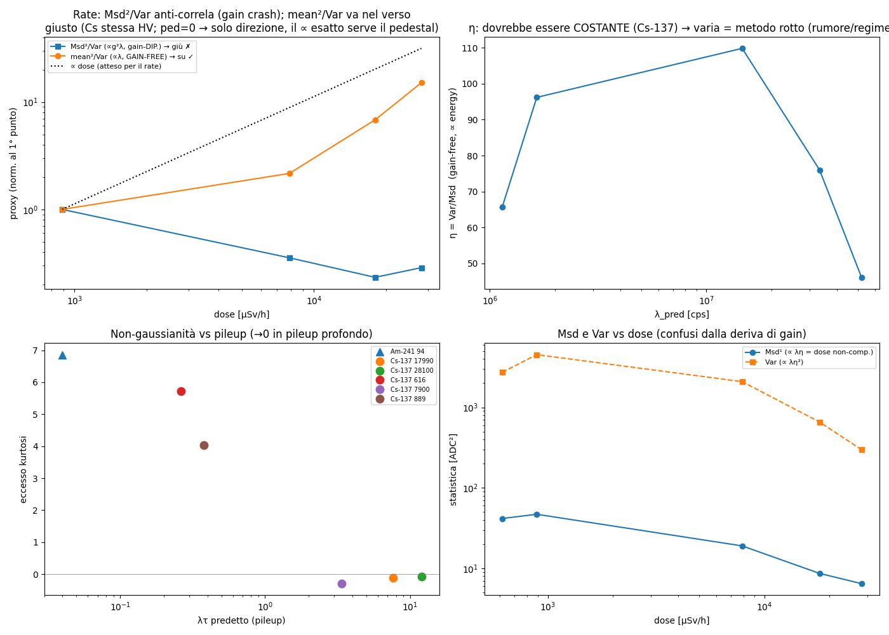
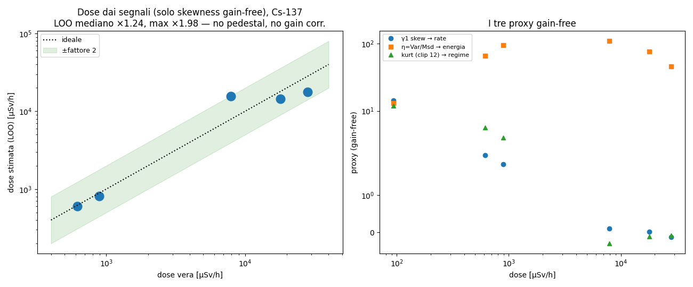
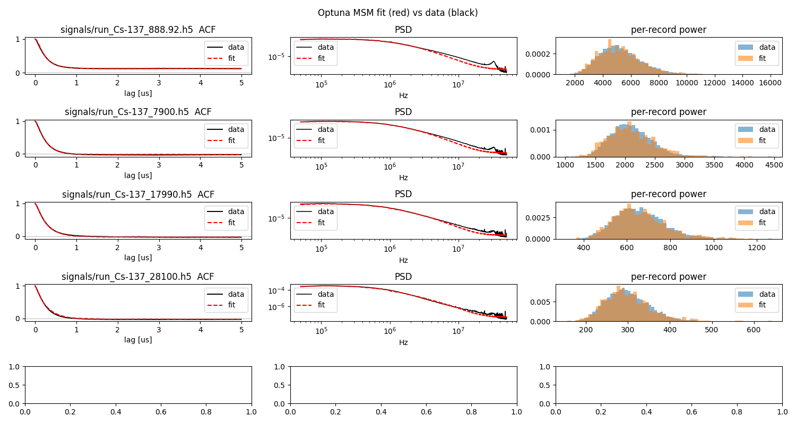

# Relazione — stime, gain-free e pipeline di dose

Parte di [[RELAZIONE]].

## 5. I protagonisti: λ, energia, il gain g

Fermiamoci a presentare i personaggi, perché li confonderemo di continuo se non
li fissiamo ora.

- **λ (lambda) — il rate.** Numero di eventi al secondo che arrivano al
  rivelatore. "Evento" = un decadimento della sorgente che deposita energia →
  scintillazione → fotoelettroni. È la grandezza che vogliamo perché, a energia
  fissa, **la dose è proporzionale a λ** (più eventi al secondo = più radiazione).
  Ordine di grandezza qui: da ~0.2 a ~50 milioni di conteggi al secondo (Mcps).

- **$A_k$ e l'energia.** L'ampiezza del singolo evento, proporzionale
  all'energia depositata. La distribuzione delle $A_k$ (la SER / spettro di
  energia) entra solo attraverso i suoi momenti $\langle A^n\rangle$.
  L'**energia media per evento** è ciò che, moltiplicato per λ, dà la dose.

- **g — il gain del PMT.** Il fattore di moltiplicazione dei dinodi. **È il
  guaio.** Il gain **scala tutte le ampiezze**: se $g$ raddoppia, ogni impulso
  raddoppia, $A_k \to g\,A_k$. E in questo rivelatore $g$ **non è costante**:
  con un partitore resistivo passivo, ad alto rate il gain **deriva e poi
  collassa** (§13). Quindi qualunque statistica che dipenda da $g$ è
  inaffidabile: non sappiamo separare "più eventi" da "gain più basso". Questo
  è il muro contro cui sbatte l'approccio ingenuo.

- **dose** $\dot H = k\,\lambda\,\langle E\rangle$ — rate × energia media ×
  fattore di conversione. Il nostro obiettivo finale.

Vediamo subito come il gain entra nei cumulanti. Sotto lo scaling $A \to gA$, per
Campbell $\kappa_n = \lambda\langle A^n\rangle I_n \to g^n\,\kappa_n$. Cioè:

$$ \text{media} \propto g,\quad \text{Var} \propto g^2,\quad \kappa_3 \propto g^3,\quad \kappa_4 \propto g^4 $$

Ogni cumulante porta una potenza diversa di $g$. Questo, lungi dall'essere un
problema, è la **chiave della soluzione** — §7.

---

## 6. Il regime di pile-up: l'occupancy λτ

Quanto è "affollato" il segnale? Il numero adimensionale che conta è
l'**occupancy**:

$$ \text{occupancy} = \lambda\,\tau = \text{numero medio di impulsi che si sovrappongono in un tempo } \tau $$

dove τ è la durata di un impulso. Tre regimi, e tre comportamenti diversi:

1. **λτ ≪ 1 — impulsi risolti.** Gli impulsi sono isolati, ben separati. Il
   segnale è "spiky": tante zone di baseline e picchi occasionali → distribuzione
   fortemente **asimmetrica e a coda lunga** → $\kappa_3, \kappa_4$ **grandi**.
   (Caso Am-241, λτ = 0.04.)

2. **λτ ~ 1 — pile-up moderato.** Gli impulsi cominciano a sovrapporsi ma la
   granularità si intravede ancora.

3. **λτ ≫ 1 — pile-up profondo.** Migliaia di impulsi si sommano ad ogni istante.
   Qui entra in gioco il **teorema del limite centrale**: la somma di tantissimi
   contributi indipendenti tende a una **gaussiana**. E per una gaussiana (§4)
   **$\kappa_3, \kappa_4 \to 0$**. Il segnale diventa un fuzz gaussiano liscio,
   che ha perso ogni memoria del "quanti erano" e "quanto grandi". (Caso Cs-137
   28100, λτ = 12.)

Questa è la tensione centrale di tutto il progetto:

> Più il rate è alto (regime che ci interessa!), più il segnale
> **gaussianizza**, più le informazioni di conteggio e di energia
> **evaporano** dai cumulanti alti. È un muro fisico, non un difetto di metodo.

Lo vediamo direttamente nei dati: l'excess kurtosis passa da **+6.9** (Am-241,
risolto) a **−0.08** (Cs 28100, gaussiano) monotonamente con l'occupancy prevista.
Il regime di pile-up predetto dalla dose è quindi **confermato dal segnale**, e
in modo *gain-free* (kurtosi e skewness non dipendono da $g$, §7) — un
cross-check pulito.

---

## 7. L'idea chiave: statistiche *gain-free*

Ricordiamo il problema (§5): il gain $g$ deriva e collassa, e **inquina** ogni
statistica che dipende da lui. La soluzione non è *correggere* il gain (non lo
conosciamo), ma **scegliere combinazioni di statistiche in cui $g$ si cancella
da solo**.

Il trucco è banale una volta visto. Sappiamo che $\kappa_n \propto g^n$. Allora
costruiamo **rapporti in cui le potenze di $g$ si elidono**:

$$ \gamma_1 = \frac{\kappa_3}{\kappa_2^{3/2}} \propto \frac{g^3}{(g^2)^{3/2}} = \frac{g^3}{g^3} = 1 \quad(\text{gain-free!}) $$

$$ \gamma_2 = \frac{\kappa_4}{\kappa_2^{2}} \propto \frac{g^4}{g^4} = 1 \quad(\text{gain-free!}) $$

$$ \frac{\text{media}^2}{\text{Var}} \propto \frac{g^2}{g^2} = 1 \quad(\text{gain-free!}) $$

Ecco la tabella completa dei nostri strumenti, con cosa misura ciascuno e come
scala col gain. **Questa tabella è il cuore operativo della relazione.**

> Prima di leggerla, due sigle che compaiono qui e le incontreremo spesso:
> **Msd** = *mean square successive difference*, una misura di potenza robusta
> alle derive lente (definita per bene in [§8](#8-chi-è-η-chi-è-λ-le-stime-una-per-una)); per ora basta sapere che
> scala come la varianza, $\propto g^2$. **CV** = *coefficient of variation* =
> deviazione standard / media (una dispersione relativa, adimensionale).
> $\tau_\text{eff}$ è la durata efficace dell'impulso, $\approx \tau$.

| statistica | teoria (Campbell) | scala col gain | misura fisicamente | gain-free? |
|---|---|---|---|---|
| media $m=\kappa_1$ | $\lambda\langle A\rangle I_1$ | $\propto g$ | corrente DC ≈ dose non-compensata | ❌ |
| Var $=\kappa_2$ | $\lambda\langle A^2\rangle I_2$ | $\propto g^2$ | potenza di fluttuazione | ❌ |
| Msd $=C(0)-C(\delta)$ | $\propto \lambda\langle A^2\rangle$ (come Var, ad alta-f) | $\propto g^2$ | potenza shot ad alta-f | ❌ |
| skewness $\gamma_1$ | $\propto \lambda^{-1/2}$ | invariante | $1/\sqrt{\text{occupancy}}$; segno = polarità | ✅ |
| excess kurtosis $\gamma_2$ | $\propto \lambda^{-1}$ | invariante | $1/\text{occupancy} \approx 1/(\lambda\tau_\text{eff})$ | ✅ |
| von Neumann $\text{Msd}/\text{Var}$ | (forma) | invariante | rise/roughness vs $\tau_\text{corr}$ | ✅ |
| CV potenza per-record | $\propto 1/\sqrt{\text{occupancy}}$ | invariante | # eventi per finestra | ✅ |
| **mean²/Var** | $\lambda\langle A\rangle^2/\langle A^2\rangle$ | invariante | **rate λ** | ✅ |
| **η = Var/Msd** | $\langle A^2\rangle/\langle A\rangle$ | invariante | **energia media** | ✅ |

Due cose da notare:

- Le statistiche **gain-dipendenti** (media, Var, Msd) sono quelle che
  istintivamente useresti per misurare "quanto segnale c'è" — e sono proprio
  quelle rovinate dal crollo del gain. Nei dati reali infatti la varianza e la
  Msd **anti-correlano con la dose** (crescono e poi *scendono*!), perché il gain
  cala più in fretta di quanto il rate salga. Ingannevoli.
- Le statistiche **gain-free** (skewness, kurtosi, mean²/Var, η) sono la nostra
  cassetta degli attrezzi buona.

Nel dettaglio, l'**excess kurtosis** merita una riga:
$$ \gamma_2 = \frac{\kappa_4}{\kappa_2^2} = \frac{1}{\lambda}\,\frac{\langle A^4\rangle}{\langle A^2\rangle^2}\,\frac{I_4}{I_2^2} \;\propto\; \frac{1}{\lambda\tau_\text{eff}} $$
cioè è **l'inverso dell'occupancy**: grande a basso rate (spiky), → 0 in pile-up
profondo (gaussiano). Non misura l'energia: misura **quanto è affollato** il
segnale. La skewness porta la stessa informazione ($\propto 1/\sqrt{\lambda\tau}$)
più il **segno** (la polarità dell'impulso). Sono i nostri "termometri" del
regime.

---

## 8. Chi è η, chi è λ: le stime, una per una

Adesso possiamo presentare per bene i due protagonisti che il committente voleva
chiari: **λ e η**. Sono le due grandezze fisiche che estraiamo, ciascuna con la
sua ricetta gain-free.

### λ — il rate. Due strade.

**Strada A — `mean²/Var` (in continua, DC).** È la stima più bella perché il gain
si cancella *esattamente*, per *qualunque* legge $g(\lambda)$:
$$ \frac{\text{media}^2}{\text{Var}} = \frac{(g\lambda\langle A\rangle I_1)^2}{g^2\lambda\langle A^2\rangle I_2} \;\propto\; \lambda\,\frac{\langle A\rangle^2}{\langle A^2\rangle} $$
Il gain sparisce anche *dentro il collasso*. Costo: serve la **media assoluta** del
segnale, cioè lo **zero vero** (il *pedestal*). Con dati a baseline sottratta non
ce l'abbiamo → serve un **dark run** (§14). È il pezzo mancante più prezioso.

**Strada B — cumulanti pari $\kappa_2^2/\kappa_4$ (in alternata, AC).** Non serve
la media:
$$ \lambda \;\propto\; \frac{\kappa_2^2}{\kappa_4}\cdot(\text{fattore di forma/SER}) $$
Funziona a pile-up **moderato**, ma **muore in pile-up profondo** (là
$\kappa_4 \to 0$ e il rapporto esplode). Sui nostri dati funziona per l'anodo
veloce, fallisce per il preamp lento (troppo pochi tempi di correlazione per
finestra, $\kappa_4$ distorto).

**Strada C — via la skewness (occupancy).** Poiché $\gamma_1 \propto
1/\sqrt{\lambda\tau}$, una **calibrazione** monotòna lega la skewness al rate.
È la strada che regge su tutto il range utile e che useremo nella pipeline (§10).

### η — l'energia media (gain-free).

$$ \boxed{\;\eta \;\equiv\; \frac{\text{Var}}{\text{Msd}} \;\propto\; \frac{\langle A^2\rangle}{\langle A\rangle}\;} $$

**Chi è η, a parole:** è un **proxy dell'energia media per evento**, costruito
come rapporto tra due potenze (la varianza totale e la potenza shot ad alta
frequenza). Entrambe scalano come $g^2$, quindi nel rapporto **il gain sparisce**.
Dimensionalmente è un'energia (× costanti), e nei dati Cs cresce/decresce coerente
con l'energia depositata. Il suo limite: vale solo **nel regime giusto** (pile-up
pieno con granularità pe risolta, basso rumore); fuori regime diventa rumoroso
(sui nostri dati spesso ne siamo ai margini, quindi η dà l'ordine di grandezza,
non la spettroscopia).

**Msd**, che compare al denominatore, va spiegato perché è un attore ricorrente:
è la **Mean Square of Successive Differences**,
$\text{Msd} = \frac12\langle (x_{i+1}-x_i)^2\rangle = C(0)-C(\delta)$, cioè la
varianza delle differenze tra campioni successivi. Il suo pregio (dovuto a **von
Neumann**) è che, usando solo *differenze*, **cancella le derive lente** (drift
termici, baseline wander, 1/f) che gonfierebbero la varianza semplice. È una
misura di potenza *robusta alle derive*.

---

## 9. Il metodo Target e perché va corretto

Esiste un metodo brevettato che fa esattamente dosimetria da PMT in pile-up: il
metodo **Target** (brevetto US2021/0055429 A1, Stein). Le sue equazioni operative:
$$ \text{Msd} = \lambda\,\eta \;(\text{Eq.2}),\qquad \eta = \frac{\text{Var}}{\text{Msd}}\;(\text{Eq.3}),\qquad \dot H = Z(\eta)\cdot\text{Msd}\;(\text{Eq.4}) $$
cioè: dalla Msd e dalla Var ricava un rate $\hat\lambda = \text{Msd}^2/\text{Var}$
e un'energia $\eta$, e compone la dose.

Lo abbiamo applicato ai 6 run reali e — punto delicato — **validato con un
simulatore a verità nota** (§11). La validazione ha rivelato un errore di segno
che val la pena raccontare, perché è istruttivo:

- **$\eta = \text{Var}/\text{Msd}$ è gain-free** (∝ energia). Verificato: in una
  scansione di gain ×0.5–4 a rate ed energia fissi, η resta **costante a 18.0**.
- **$\hat\lambda = \text{Msd}^2/\text{Var} \propto g^2$** — cioè **NON** è
  gain-free! Nella stessa scansione scala come $g^2$ (10→41→164→656). Quindi
  quando il gain collassa, $\hat\lambda$ collassa con lui e **anti-correla con la
  dose**. È esattamente ciò che si vede nei dati reali (Msd e λ̂ scendono mentre
  la dose sale).

La lezione: il rate **non** va preso da $\text{Msd}^2/\text{Var}$ (porta il
gain²), ma da **`mean²/Var`** (gain-free, §8) — che nella validazione
**sopravvive al crollo del gain**, o in alternativa dalla skewness. Target è
un ottimo punto di partenza, ma la sua stima di rate va sostituita con una
gain-free. È questa correzione che rende il metodo robusto al nostro hardware.

---

## 10. La pipeline di dose (il risultato principale)

Mettendo insieme i pezzi, ecco lo stimatore di dose finale — **deployabile**, che
usa **solo statistiche gain-free** e **nessun pedestal / dark run / correzione di
gain**.

**Idea:** $\dot H = k\,\lambda\,\langle E\rangle$. Il rate λ dalla **skewness**
$\gamma_1$ (proxy di occupancy, gain-free); l'energia $\langle E\rangle$ da **η**
(gain-free). Niente statistiche gain-dipendenti a runtime.

**Pipeline:**
1. Dal blocco di forme d'onda calcola le feature gain-free: $\gamma_1$ (skew),
   $\eta = \text{Var}/\text{Msd}$, $\gamma_2$ (kurt).
2. **Auto-diagnosi del regime** dalla kurtosi + stabilità di $\gamma_1$: se
   $\gamma_1$ è instabile / $\gamma_2 \gg 1$ → *bassissimo rate, impulsi risolti*
   → la pipeline dice "**conta gli impulsi**" (fuori dal metodo statistico; è il
   caso Am-241). Altrimenti procede.
3. **Rate** da $\gamma_1$ via calibrazione; **energia** da η; **dose** da
   $\ln\dot H = a + b\,\text{asinh}(\gamma_1)$.

Calibrazione su questi dati (Cs-137):
$$ \ln(\dot H\,[\mu\text{Sv/h}]) = 9.685 - 2.158\,\text{asinh}(\gamma_1) $$
(l'$\text{asinh}$ — seno iperbolico inverso — è usato al posto del logaritmo
perché è quasi lineare vicino a zero e logaritmico per $|\gamma_1|$ grande, e
soprattutto **accetta anche skewness negative**: nel pile-up profondo $\gamma_1$
può diventare leggermente $<0$, dove un $\ln$ esploderebbe.)

**Il risultato.** Dalla sola forma statistica del segnale si stima la dose entro
un **fattore ×1.24 mediano (×1.98 massimo) su 2.5 decadi**, in **leave-one-out**:

| dose vera [µSv/h] | dose stimata (LOO) | fattore d'errore |
|---|---|---|
| 616 | 602 | ×1.02 |
| 889 | 812 | ×1.09 |
| 7900 | 15680 | ×1.98 |
| 17990 | 14490 | ×1.24 |
| 28100 | 17650 | ×1.59 |

**Cos'è il "leave-one-out" (LOO), e perché il numero è onesto.** La calibrazione
ha 2 parametri ($a,b$) e i punti Cs sono solo 5. Se fittassi su tutti e 5 e
misurassi l'errore *sugli stessi 5*, starei barando: misurerei quanto bene una
retta ci passa in mezzo, non quanto predice una misura *nuova*. Il LOO evita
questo: per ogni run, **lo butto via**, ri-fitto sui 4 rimasti, e **predìco il
run escluso** con una calibrazione che non l'ha mai visto. Ripetuto 5 volte, dà
un errore **fuori-campione** — la stima onesta di quanto sbaglierei su una misura
mai usata per tarare.

**Perché è robusto/interessante:** gain-free *by design* (funziona anche sul run a
HV diversa); nessun dark run; auto-diagnosi del regime. **Limiti onesti:**
l'energia è rozza (~×1.5, buona per il fattore di conversione, non per
spettroscopia); ad alto rate $\gamma_1 \to 0$ (pile-up profondo) e la sensibilità
cala (il punto peggiore, 7900, è proprio alla transizione); la calibrazione
$a,b$ va ri-tarata per un altro tubo/HV, ma la *struttura* gain-free è
trasferibile.

---

## 11. Come abbiamo verificato di non star sognando: simulazione e fit

Ogni affermazione sopra è stata controllata contro **verità nota**, perché su
dati reali non conosciamo λ, energia e gain in modo indipendente. Tre livelli di
verifica.

**(a) Simulatore coerente del segnale (`simulate_pmt.py`).** Genera lo shot noise
in due modi equivalenti — somma esatta di impulsi, e integrazione della SDE a
salti $dY = -\frac{Y}{\tau}dt + dJ$ (la forma "equazione differenziale
stocastica" del processo). Confronto modello-vs-dati su autocorrelazione, PSD e
distribuzione di potenza per record:

**(b) Fit quantitativo dei parametri (`fit_simulator.py`).** Invece di tarare a
mano, i parametri (τ_rise, τ_fall, rate, larghezza SER, rumore) sono fittati ai
dati con *method of simulated moments* (ottimizzatore Optuna, 500 trial/file).
Il gain assoluto è degenere e esce dal conto (tutte le metriche sono scale-free —
di nuovo il tema gain-free). Una lezione tecnica utile: per far combaciare la
**forma d'onda** (non solo gli spettri integrati) è servita una metrica sensibile
alla **scala fine** (la frazione di potenza in banda media 0.3–8 MHz), altrimenti
il fit smussava troppo il rise-time.

*(La "distanza di Wasserstein" è una misura di quanto due distribuzioni
differiscono — intuitivamente, il "lavoro" per spostare una nell'altra; qui
confronta la PSD misurata con quella simulata.)*

**(c) Simulatore a livello di fotoelettrone (`pe_synth.py`).** Il più importante
per validare le *stime*: un processo di Cox/branching (Poisson di eventi → η
fotoelettroni ciascuno → decadimento di scintillazione → shot pe → gain +
rumore), con **λ, energia e gain imposti da noi**. Qui abbiamo smontato e
verificato ogni affermazione del §7–9:

- scansione di **gain** (λ, η fissi): **η costante**, $\hat\lambda \propto g^2$
  → conferma cosa è gain-free e cosa no;
- scansione di **λ** (gain fisso): mean, Var, Msd, λ̂ tutti ∝ λ → il metodo
  Target funziona *quando il gain è fisso*;
- **gain-crash iniettato** $g(\lambda) = g_0/(1+\lambda/\lambda_c)$: Msd, λ̂, media
  diventano **non-monotoni** (salgono e poi scendono, *come i dati reali!*), ma
  **`mean²/Var` recupera λ** perché il gain si cancella esattamente. Questa è la
  prova regina che la strada gain-free è quella giusta.

**(d) Validazione sintetica della pipeline di dose.** Rigenerando forme d'onda a
λ noto su tutto il range e applicando la calibrazione fittata sul reale, la dose
stimata segue la vera entro **×1.35 mediano (×1.60 max)** — coerente con l'LOO
reale (×1.24/×1.98). Conferma che la calibrazione non sta solo interpolando 5
punti fortunati.

---

