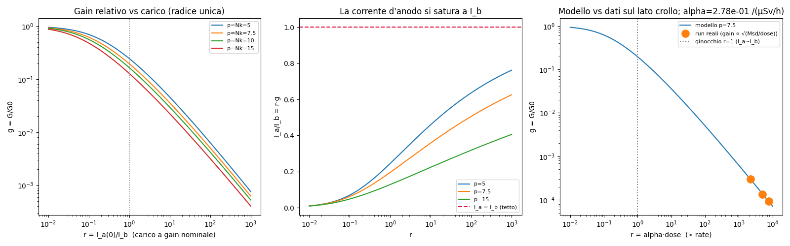
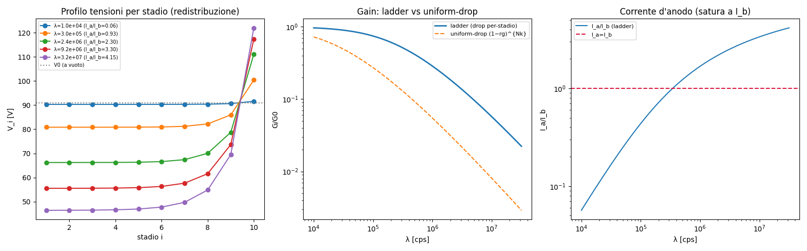
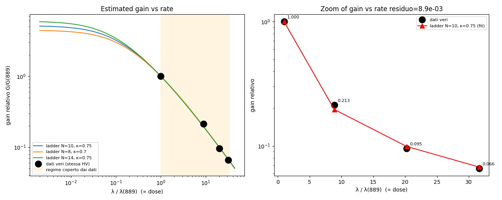

# Relazione — limiti e modello ladder del gain

Parte di [[RELAZIONE]].

## 12. Cosa NON si può misurare (limiti onesti)

Un buon metodo si giudica anche da cosa dichiara *impossibile* con questi dati.

- **La forma dello spettro di ampiezza P(A) / SER non è estraibile in pile-up.**
  Servirebbe il cumulante *dispari* $\kappa_3$, che in pile-up è (a) piccolo (il
  segnale gaussianizza, $\kappa_3 \to 0$) e (b) rumorosissimo da stimare.
  Dimostrato: anche una simulazione pulita con $10^4$ record e CV nota lo recupera
  male. Per lo spettro P(A) completo servono **eventi risolti** (run a basso rate
  / dark).

- **In pile-up profondo (anodo, λτ ≈ 12–70) resta solo $\lambda\langle
  A^2\rangle$** (la varianza). Rate ed energia **non si separano** dal solo bulk
  del segnale: la granularità di singolo evento è persa. Per romperla serve la
  **media sopra il pedestal** (§14) o un **run a basso rate**.

- **L'energia assoluta (keV) richiede la calibrazione di gain.** Le nostre stime
  di energia sono **relative**; η dà l'ordine di grandezza, non la spettroscopia.

- **Il rate assoluto porta un sistematico ~×6 dovuto alla larghezza della SER**
  (il momento $\langle A^2\rangle/\langle A\rangle^2$, l'*excess noise factor* di
  Personick). Si stringe con un prior fisico sulla SER, o azzera con un run a
  basso rate che la misuri.

Sulla letteratura esplorata (Roessl–Fourier/level-crossing, Personick, Rice,
Lowen–Teich): la direzione è giusta e già implementata (trattare il segnale come
Poisson filtrato / Campbell). Il **level-crossing di Rice/Roessl** l'abbiamo
testato come stima alternativa di λ: funziona a basso rate ($N(u) \approx
\lambda$) ma **satura in pile-up** alla frequenza RMS della forma d'impulso —
stesso muro dei cumulanti. Resta utile come *misura di forma* indipendente, non
come proiettile d'argento per il rate.

---

## 13. Spin-off: il modello *ladder* della perdita di gain

Questo capitolo è un ramo laterale ma bello, e spiega **perché** il gain
collassa — cioè perché tutto il resto della relazione ha dovuto diventare
gain-free. Lo teniamo focalizzato sul **solo modello a scala (ladder)** del
partitore.

### Il meccanismo, a parole

Il gain di un PMT è dato dalle tensioni tra i dinodi, che a riposo sono fissate
da un **partitore resistivo** (una catena di resistori tra l'alta tensione e
massa). Ma quando il rate è alto, la **corrente d'anodo** diventa importante: gli
elettroni moltiplicati vengono "prelevati" dal partitore, ne **perturbano le
tensioni**, e quindi **cambiano il gain**. Si crea un anello di retroazione:

```
rate ↑  →  corrente elettronica ↑  →  perturba il partitore
     →  tensioni tra dinodi ↓  →  gain ↓  →  (corrente d'anodo)
```

### Il modello minimale (per capire il ginocchio)

Ipotesi omogenee: $N$ stadi, resistori tutti uguali $R$, corrente di bias
$I_b = V_{HV}/(NR)$, legge di dinodo $\delta(V) = aV^\kappa$ con $\kappa \approx
0.7$–$0.8$. Chiamiamo $n_0$ il numero medio di fotoelettroni prodotti per evento
al fotocatodo (così la corrente d'anodo è $I_a = q\,n_0\,\lambda\,G$: carica ×
fotoelettroni/evento × rate × gain). Il carico di segnale abbassa ogni tensione della stessa frazione
$\rho \equiv I_a/I_b$ (corrente d'anodo / corrente di bias). Poiché
$G = \prod_i \delta_i \propto (\prod_i V_i)^\kappa$, si ottiene un'equazione
**auto-consistente** ($G$ compare anche dentro $\rho$, perché $I_a = q n_0
\lambda G$):

$$ \boxed{\;G = G_0\,(1-\rho)^{N\kappa},\qquad \rho = \frac{q\,n_0\,\lambda}{I_b}\,G\;} $$

**Comportamento** — governato da un solo numero, il carico $\rho = I_a/I_b$:

- **basso rate** ($I_a \ll I_b$): $G \approx G_0$, piatto (droop lineare
  iniziale);
- **collasso**: al crescere di λ, $\rho \to 1$ e $G \to 0$; poiché $I_a = q n_0
  \lambda G$, **la corrente d'anodo si satura verso $I_b$** (non può superare il
  bias). Ginocchio a $\lambda_\text{knee} \sim I_b/(q n_0 G_0)$.

Bellissimo cross-check col brevetto: il limite tipico "**max anode current 0.1
mA**" *è* la corrente di bias tipica ($V_{HV}\sim 1$ kV, $\Sigma R\sim 10$ MΩ →
$I_b \sim 0.1$ mA). Il collasso a $I_a \sim I_b$ **è** il tetto a 0.1 mA.



### Il modello ladder completo (niente approssimazioni)

Qui **non** assumiamo caduta uniforme: risolviamo davvero il circuito. Il
partitore è una **rete a scala** ("ladder") di resistori con l'alimentatore che
tiene $\sum_i V_i = V_{HV}$ fissa. Numerati i nodi $U_0=0$ (catodo),
$U_1,\dots,U_N$ (dinodi), $U_{N+1}=V_{HV}$ (anodo):

- tensione dello stadio $i$: $V_i = U_i - U_{i-1}$, gain di stadio
  $\delta_i = a V_i^\kappa$;
- corrente di fascio che entra nel dinodo $i$: $J_i = I_0 \prod_{j<i}\delta_j$
  (con $I_0 = q n_0 \lambda$), che **cresce verso l'anodo** perché si moltiplica
  a ogni stadio;
- il dinodo $i$ preleva dal partitore $t_i = (\delta_i - 1)J_i$.

La **legge di Kirchhoff** (KCL) ad ogni nodo dà il sistema non lineare accoppiato:
$$ \frac{U_{i-1} - 2U_i + U_{i+1}}{R} = (\delta_i - 1)\,J_i,\qquad i = 1,\dots,N $$
(a sinistra il Laplaciano discreto = corrente netta dei resistori; a destra la
corrente prelevata dal tubo). $N$ equazioni, risolte numericamente con
continuazione in λ. A vuoto ($I_0=0$) torna la rampa lineare $V_i =
V_{HV}/(N{+}1)$, come dev'essere.

**Cosa emerge:**



1. **Redistribuzione** (sx): al crescere del rate il profilo di tensione si
   inclina — i **primi stadi si affamano** ($V_1: 91\to 46$ V), gli **ultimi
   salgono sopra $V_0$** ($V_{10}\to 122$ V). Il meccanismo qualitativo "ultimi
   su / primi giù" **emerge da solo** dal circuito omogeneo, senza rompere nulla
   a mano.

2. **Ma il gain totale resta monotòno decrescente — niente "bump".** Questo è un
   **teorema**, non un dettaglio numerico: essendo $G \propto (\prod_i
   V_i)^\kappa$ e $\sum_i V_i = V_{HV}$ *fissa*, ogni redistribuzione a somma
   costante **abbassa il prodotto** $\prod_i V_i$ (disuguaglianza delle medie,
   **AM-GM**). Quindi il gain può *solo* scendere. Il ladder scende più lento
   dell'uniform-drop (la salita degli ultimi stadi compensa in parte), ma **non
   risale mai**.

   → Conseguenza forte: se in un esperimento il gain *salisse* davvero a rate
   moderato (il "bump" che a volte si osserva), **non** potrebbe nascere da questa
   redistribuzione. Servirebbe fisica *fuori* dal modello: primo stadio protetto
   (zener/$R_1$ maggiore), alimentatore non rigido, o *space charge* al primo
   dinodo.

### Il ladder riproduce i dati reali

Fit ai **4 run a stessa HV** del Cs-137 (baseline ADC ~195: {889, 7900, 17990,
28100} µSv/h), con gain relativo $\propto \sqrt{\text{Msd}/\text{dose}}$ e un solo
parametro libero (la scala di carico $c$; $N,\kappa,R,V_{HV}$ fissati). Il ladder
**riproduce il calo di gain 15× misurato** (modello 15×, residuo ~$9\times
10^{-3}$):



**Cosa si stima bene:** la *scala di carico* — dove ti trovi sulla curva di
crollo — che basta per prevedere/correggere il gain nel regime di lavoro. **Cosa
resta degenere:** i parametri $N, \kappa, R$ separatamente. Il motivo (e la
domanda giusta) è che **tutti** i run, anche il più basso (889 µSv/h ≈ 1.65
Mcps), sono **oltre il ginocchio** — che qui sta a $\lambda_\text{knee}\sim 180$
kcps, ~10× più in basso. Nel regime di collasso ($r \gg 1$) vale universalmente
$g \propto 1/\lambda$, indipendente da $N,\kappa,R$: quei parametri si
discriminerebbero solo con dati **pre-crash veri** (rate ≲ 180 kcps, o una HV più
bassa che sposta il ginocchio nel range misurabile).

**Morale dello spin-off:** il gain di questo PMT, ad alto rate, **crolla come
$1/\lambda$** perché la corrente d'anodo satura alla corrente di bias del
partitore. Ecco *perché* media/Var/Msd sono inservibili per la dose, e perché
tutta la pipeline (§10) è costruita su statistiche gain-free.

---

