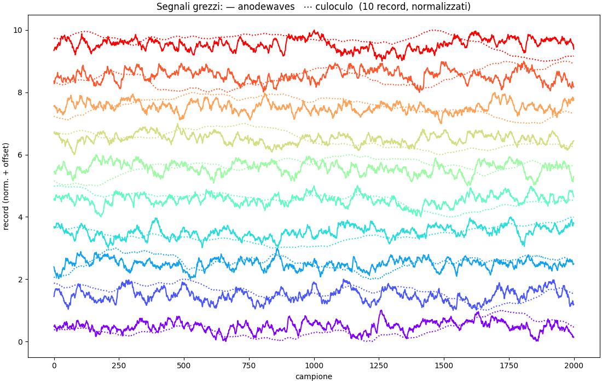

# Relazione — il problema e i dati

Parte di [[RELAZIONE]].

## 1. Il problema

Abbiamo un **fotomoltiplicatore (PMT)** accoppiato a uno scintillatore, che
guarda una sorgente radioattiva. Vogliamo misurare la **dose**. Il problema è che la sorgente è così intensa che il PMT
lavora a **rate altissimo**: gli impulsi prodotti dai singoli eventi
**si sovrappongono continuamente** (pile-up).
Il modo classico di fare dosimetria — *"riconosci ogni impulso, misurane
l'altezza, mettili in un istogramma"* (Pulse Height Analysis) — qui **non
funziona**: gli impulsi non sono più separabili. Il segnale digitizzato
assomiglia a un rumore continuo, non a una sequenza di picchi.

La proposta è ribaltare il punto di vista:

> Invece di combattere il pile-up cercando di separare gli impulsi, lo
> **modelliamo**. Trattiamo il segnale come un **processo stocastico continuo**
> e stimiamo la dose dalle sue **proprietà statistiche** (media, varianza,
> asimmetria, autocorrelazione…), senza mai cercare i singoli impulsi.

Questo approccio è standard in telecomunicazioni, fotonica, radar — ma poco
usato in elettronica nucleare, che resta ancorata al pulse-finding. È lì che
sta lo spazio per fare qualcosa di nuovo.

---

## 2. Il rivelatore e i dati

Un **PMT** funziona così: un fotone di scintillazione strappa un elettrone dal
**fotocatodo** (il "fotoelettrone"); questo viene accelerato verso una serie di
elettrodi, i **dinodi**, ognuno dei quali moltiplica il numero di elettroni di
un fattore δ ≈ 3–5. Con ~10 dinodi in cascata si arriva a un **gain**
complessivo $G = \prod_i \delta_i \sim 10^6$: un singolo fotoelettrone diventa
un milione di elettroni, cioè un impulso di corrente misurabile all'**anodo**.
Su questo torneremo nel §13, perché il gain è il vero antagonista di questa
storia.

Abbiamo due tipi di dato.

**(a) Due file di caratterizzazione** — `anodewaves.npy` e `culoculo.npy`
(nomi di lavoro), ciascuno **1000 record × 2000 campioni**, a $f_s = 100$ MS/s
(cioè $\Delta t = 10$ ns, finestra di **20 µs** per record). Servono a capire
*che tipo di segnale* stiamo guardando. Sono due canali diversi:

- **`anodewaves`** — segnale d'anodo "veloce": fuzz rapido, tempo di
  correlazione τ ≈ 250 ns;
- **`culoculo`** — uscita di un **preamplificatore di carica**: integra la
  corrente, quindi vaga lentamente, τ ≈ µs.

Un primo dubbio ragionevole: sovrapponendo pochi record *sembra* che i due file
seguano gli stessi trend lenti — sono forse lo stesso segnale, uno filtrato
dall'altro? **No.** Lo abbiamo verificato in modo rigoroso (coerenza spettrale
mediata su 1000 record, piatta al floor $1/N$; test allineati-vs-mescolati:
distribuzioni identiche). La somiglianza è un **artefatto**: `culoculo` ha solo
~6–7 oscillazioni lente *indipendenti* per finestra, e due tracce con così pochi
gradi di libertà "sembrano" correlate per puro caso (~14% dei record ha
$|r|>0.5$ anche mescolando gli indici a caso).

**(b) Sei run reali a dose nota** (`jeanluke/anode_waveforms/*.h5`) — è il
dataset che ci permette di *verificare* tutto, perché conosciamo la risposta.
Ogni run è $10^4 \times 2000$ campioni, **DC-coupled** (importante: vediamo il
livello continuo, non solo le fluttuazioni). Sorgenti Am-241 e Cs-137 a distanze
diverse, cioè a **dose nota** che spazia su ~2.5 decadi:

| nuclide | dose [µSv/h] | rate atteso λ [Mcps] | occupancy λτ | regime |
|---|---|---|---|---|
| Am-241 | 94 | 0.17 | 0.04 | impulsi **risolti** |
| Cs-137 | 616 | 1.14 | 0.26 | pile-up leggero |
| Cs-137 | 889 | 1.65 | 0.38 | pile-up leggero |
| Cs-137 | 7900 | 14.6 | 3.4 | pile-up medio |
| Cs-137 | 17990 | 33.3 | 7.7 | pile-up forte |
| Cs-137 | 28100 | 52 | 12 | pile-up **profondo** |

La dose qui è un **input noto** (dai metadati; verificata con la legge
dell'inverso del quadrato $\text{dose}\approx k\cdot\text{attività}/d^2$, torna a
±6%). L'obiettivo è **ricostruirla dal segnale** e vedere quanto ci
avviciniamo.

---

